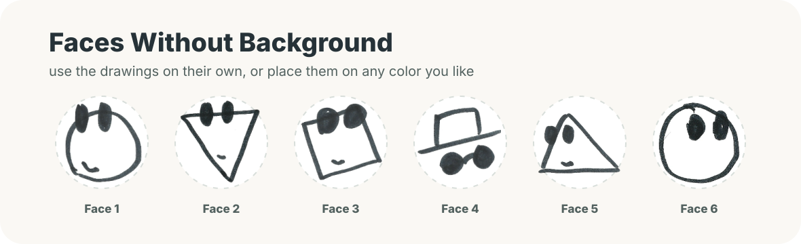
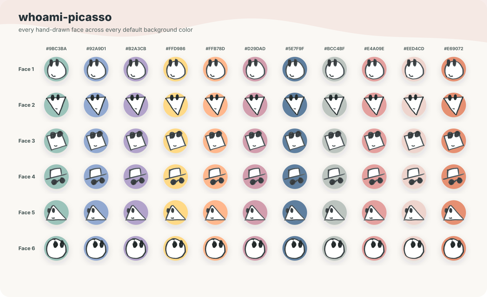
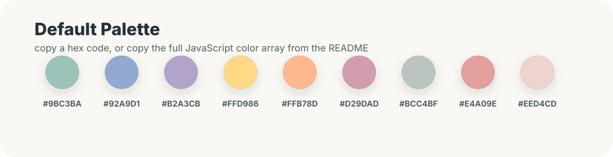

# Whoami Picasso

Reusable hand-drawn line-face avatars from ClosedReview. The package ships Georgia Lin's original PNG drawings, a soft background palette, deterministic avatar selection from any user id, and an optional React Native component.

Created by [Georgia Lin](https://github.com/GeorgiaLin).

Each avatar combines one hand-drawn face with one background color. Use a seed for a stable profile picture, ask for a random combination, or render the face without a background.

## Faces Only

The included face PNGs can be used by themselves.



```js
import { renderAvatarHtml } from 'whoami-picasso';

const faceOnly = renderAvatarHtml('user-123', {
  assetBasePath: '/avatars/line-faces',
  showBackground: false,
  size: 40,
});
```

## Combinations

Every included face works with every default background color.



## Palette



Copy the full default palette:

```js
export const colors = [
  '#9BC3BA',
  '#92A9D1',
  '#B2A3CB',
  '#FFD986',
  '#FFB78D',
  '#D29DAD',
  '#BCC4BF',
  '#E4A09E',
  '#EED4CD',
];
```

## Install

After publishing:

```sh
npm install whoami-picasso
```

Before publishing, you can test the package locally:

```sh
npm pack
npm install ./whoami-picasso-0.1.0.tgz
```

If your npm scope is different, update the `name` field in `package.json` before publishing.

## JavaScript

```js
import {
  DEFAULT_BACKGROUND_COLORS,
  getProfilePicture,
  getRandomProfilePicture,
  renderAvatarHtml,
} from 'whoami-picasso';

const avatar = getProfilePicture('user-123');
// {
//   face: 'assets/line-faces/face1.png',
//   faceIndex: 0,
//   faceName: 'face1',
//   backgroundColor: '#9BC3BA',
//   backgroundColorIndex: 0,
//   ...
// }

const randomAvatar = getRandomProfilePicture();
const colors = [...DEFAULT_BACKGROUND_COLORS];

const html = renderAvatarHtml('user-123', {
  assetBasePath: '/avatars/line-faces',
  size: 40,
});

const faceOnlyHtml = renderAvatarHtml('user-123', {
  assetBasePath: '/avatars/line-faces',
  showBackground: false,
  size: 40,
});
```

## React Native

```jsx
import {
  ProfilePicture,
  RandomProfilePicture,
} from 'whoami-picasso/react-native';

export function UserRow({ user }) {
  return <ProfilePicture userId={user.id} size={40} />;
}

export function FaceOnly({ user }) {
  return <ProfilePicture userId={user.id} size={40} showBackground={false} />;
}

export function AnonymousComment() {
  return <RandomProfilePicture size={24} />;
}
```

## Custom Palettes

```js
import { getProfilePicture } from 'whoami-picasso';

const avatar = getProfilePicture('user-123', {
  colors: ['#9BC3BA', '#FFD986', '#E4A09E'],
});
```

## Publish

```sh
npm test
npm pack --dry-run
npm publish --access public
```

## Attribution

Whoami Picasso was created by [Georgia Lin](https://github.com/GeorgiaLin) for [ClosedReview](https://github.com/GeorgiaLin/ClosedReview). The public source lives at [GeorgiaLin/whoami-picasso](https://github.com/GeorgiaLin/whoami-picasso). The included avatar artwork is original and published under the MIT license with this package.

The package is MIT licensed, including the included avatar artwork.
